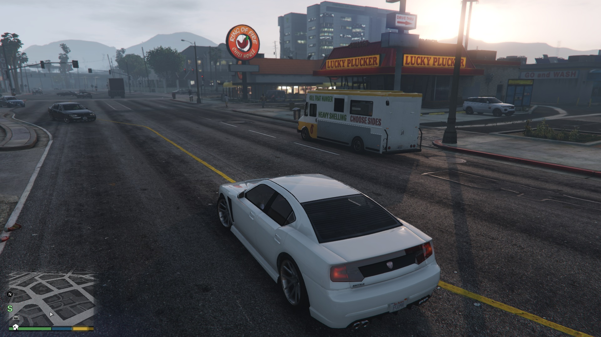
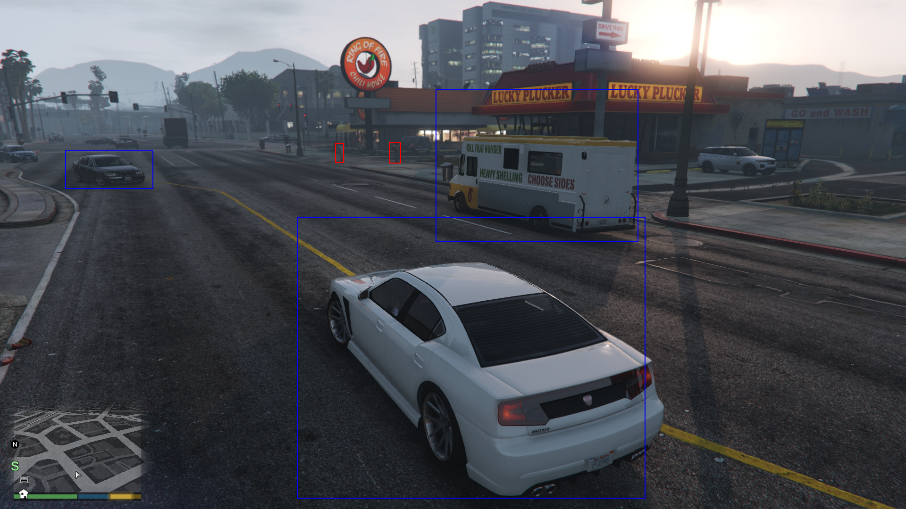
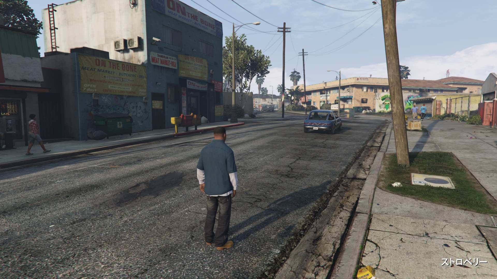

# GTA5 vision data extractor

## Overview
GTA5 mod that extracts computer vision data (pedestrian & vehicle bounding boxes detection).

## Description

- Save pedestrians and vehicles detection images during game playing.
- Output samples:
  - sample1
    - input: 
    - output: 
  - sample2
    - input: 
    - output: 

## Requirements

- Grand Theft Auto V (PC Version)
- Visual Studio 2015 or later
- .NET Framework 4.6.1 or later
- ScriptHookV
- ScriptHookVDotNet v2

## Build & Installation

- Open "gta5_vision-data-extractor.sln" and build the projects.
- Copy bin/{Debug/Release}/gta5_vision-data-extractor.dll to "{GTA5}/scripts" directory
  - "scripts" directory is installed according to ScriptHookVDotNet installation.

## Usage

- This mod auto runs.
- Change settings in the file "scripts/vision_data_extractor_settings.json"
  - DetectDistance: Extract pedestrians & vehicles around this distance.
  - OutputDirectory: Save output directory
  - SaveFrameSpan: Images are saved per this frame span (60 = 1sec.)
  - SaveObjectType: 0=Pedestrians, 1=Vehicles, 2=Peds&Vehicles

## Licenses

Except for external libraries and resources, this software is released under the New BSD License, see LICENSE.txt.
External libraries and resources which are used in this project inherit their original license.

